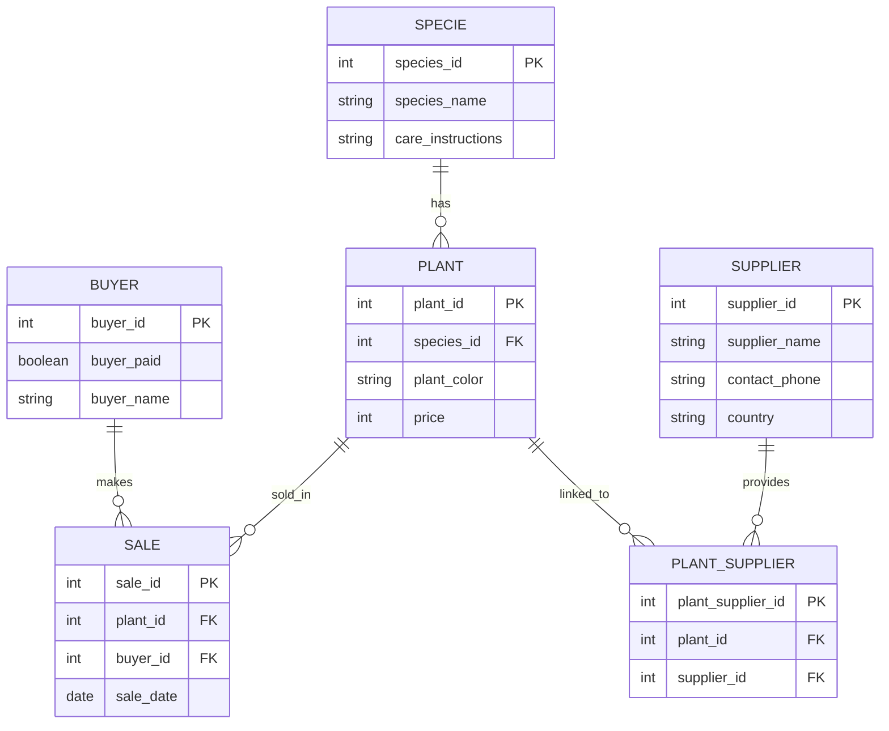

**Лабораторные работы по БД**

Перечень [лабораторные работы](https://edu.irnok.net/lib/exe/fetch.php?media=db:%D0%B2%D0%B0%D1%80%D0%B8%D0%B0%D0%BD%D1%82%D1%8B_%D0%B7%D0%B0%D0%B4%D0%B0%D0%BD%D0%B8%D0%B9_%D0%BF%D0%BE_%D1%83%D0%B4.pdf)

Telegram: [@Popaslonia]

# Постановка задачи (Ваш вариант)

**Магазин растений**

*Сущности:* 
- buyer: buyer_id (PK), buyer_paid, buyer_name
- plant: plant_id (PK), species_id, plant_color, price 
- sale: sale_id (PK), plant_id, sale_date, buyer_id
- specie: species_id (PK), species_name, care_instructions
- plant_supplier: plant_supplier_id (PK), plant_id, supplier_id
- supplier: supplier_id (PK), supplier_name, contact_phone, country

*Процессы:* 
- Клиент видит растения → выбирает → создаётся продажа в sale
- Цена фиксируется навсегда
- Если позже удаляется вид растения → продажа автоматически удаляется (каскад)
- Все действия логируются в аудит

# Лабораторная работа 1 (Проектирование логической и физической модели БД)

## ER-диаграмма

Первая нормальная форма (1NF): Соблюдена. Все атрибуты являются атомарными (неделимыми), повторяющиеся группы отсутствуют, каждая таблица имеет первичный ключ.

Вторая нормальная форма (2NF): Соблюдена. Во всех таблицах первичные ключи являются простыми (не составными), поэтому все неключевые атрибуты полностью зависят от первичного ключа.

Третья нормальная форма (3NF): Соблюдена. Транзитивные зависимости отсутствуют. Все неключевые атрибуты зависят только от первичного ключа, а не друг от друга.

Создание таблиц
```sql
-- 1. Таблица видов растений (specie)
CREATE TABLE firsovyury2271.specie (
    species_id        SERIAL PRIMARY KEY,
    species_name      TEXT NOT NULL,
    care_instructions TEXT
);

-- 2. Таблица конкретных растений (plant)
CREATE TABLE firsovyury2271.plant (
    plants_id    SERIAL PRIMARY KEY,
    species_id   INTEGER NOT NULL,
    plant_color  TEXT,
    price        INTEGER CHECK (price >= 0)
);

-- 3. Таблица поставщиков (supplier)
CREATE TABLE firsovyury2271.supplier (
    supplier_id     SERIAL PRIMARY KEY,
    supplier_name   TEXT NOT NULL,
    contact_phone   TEXT,
    country         TEXT
);

-- 4. Таблица связи растений и поставщиков (многие-ко-многим)
CREATE TABLE firsovyury2271.plant_supplier (
    plant_supplier_id SERIAL PRIMARY KEY,
    plant_id          INTEGER NOT NULL,
    supplier_id       INTEGER NOT NULL
);

-- 5. Таблица покупателей (buyer)
CREATE TABLE firsovyury2271.buyer (
    buyer_id    SERIAL PRIMARY KEY,
    buyer_paid  INTEGER DEFAULT 0,
    buyer_name  TEXT
);

-- 6. Таблица продаж (sale)
CREATE TABLE firsovyury2271.sale (
    sale_id     SERIAL PRIMARY KEY,
    plant_id    INTEGER NOT NULL,
    sale_date   DATE DEFAULT CURRENT_DATE,
    buyer_id    INTEGER NOT NULL
);

-- Добавляем внешние ключи 
ALTER TABLE firsovyury2271.plant
ADD CONSTRAINT fk_plant_specie
    FOREIGN KEY (species_id) REFERENCES firsovyury2271.specie(species_id)
    ON DELETE CASCADE;

ALTER TABLE firsovyury2271.sale
ADD CONSTRAINT fk_sale_plant
    FOREIGN KEY (plant_id) REFERENCES firsovyury2271.plant(plants_id)
    ON DELETE CASCADE;

ALTER TABLE firsovyury2271.sale
ADD CONSTRAINT fk_sale_buyer
    FOREIGN KEY (buyer_id) REFERENCES firsovyury2271.buyer(buyer_id)
    ON DELETE CASCADE;

ALTER TABLE firsovyury2271.plant_supplier
ADD CONSTRAINT fk_ps_plant
    FOREIGN KEY (plant_id) REFERENCES firsovyury2271.plant(plants_id)
    ON DELETE CASCADE;

ALTER TABLE firsovyury2271.plant_supplier
ADD CONSTRAINT fk_ps_supplier
    FOREIGN KEY (supplier_id) REFERENCES firsovyury2271.supplier(supplier_id)
    ON DELETE CASCADE;
```
Заполнение таблиц
```sql
-- 1. Виды растений (specie)
INSERT INTO firsovyury2271.specie (species_name, care_instructions) VALUES
('Фикус Бенджамина', 'Полив 1–2 раза в неделю, яркий рассеянный свет'),
('Монстера', 'Полив умеренный, высокая влажность'),
('Сансевиерия', 'Полив редкий, теневынослива'),
('Спатифиллум', 'Полив частый, любит тень'),
('Орхидея', 'Полив 1 раз в 7–10 дней');

-- 2. Конкретные растения (plant)
INSERT INTO firsovyury2271.plant (species_id, plant_color, price) VALUES
(1, 'Зелёный', 2500),
(1, 'Пёстрый', 3200),
(2, 'Тёмно-зелёный', 4500),
(3, 'Зелёный', 1800),
(4, 'Белый', 2900),
(5, 'Розовый', 3800);

-- 3. Поставщики (supplier)
INSERT INTO firsovyury2271.supplier (supplier_name, contact_phone, country) VALUES
('GreenHouse', '+31-123-456-789', 'Нидерланды'),
('Растения РФ', '+7(495)123-45-67', 'Россия'),
('Floral Co', '+39-06-123456', 'Италия'),
('Asia Plants', '+86-21-12345678', 'Китай');

-- 4. Связи растений и поставщиков (plant_supplier)
INSERT INTO firsovyury2271.plant_supplier (plant_id, supplier_id) VALUES
(1, 1),
(2, 1),
(3, 2),
(4, 3),
(5, 4),
(6, 1);

-- 5. Покупатели (buyer)
INSERT INTO firsovyury2271.buyer (buyer_paid, buyer_name) VALUES
(0, 'Иван Петров'),
(12000, 'Мария Сидорова'),
(5000, 'Алексей Иванов'),
(25000, 'Ольга Козлова');

-- 6. Продажи (sale)
INSERT INTO firsovyury2271.sale (plant_id, sale_date, buyer_id) VALUES
(1, CURRENT_DATE - 5, 1),
(3, CURRENT_DATE - 3, 2),
(5, CURRENT_DATE - 1, 3),
(2, CURRENT_DATE, 4);
```
Запрос
```sql
SELECT 
    b.buyer_id, 
    b.buyer_name, 
    b.buyer_paid, 
    s.sale_id, 
    s.sale_date, 
    p.plants_id, 
    p.plant_color, 
    p.price, 
    sp.species_name
FROM firsovyury2271.buyer b
INNER JOIN firsovyury2271.sale s
    ON b.buyer_id = s.buyer_id
INNER JOIN firsovyury2271.plant p
    ON s.plant_id = p.plants_id
INNER JOIN firsovyury2271.specie sp
    ON p.species_id = sp.species_id;
```

# Лабораторная работа 3. Представления и процедуры
### 1.Создание представлений для выходных документов
```sql
CREATE OR REPLACE VIEW firsovyury2271.sales_view
 AS
 SELECT sa.sale_id AS "ID продажи",
    sa.sale_date AS "Дата продажи",
    p.plant_color AS "Цвет растения",
    sp.species_name AS "Вид растения",
    p.price AS "Цена",
    b.buyer_paid AS "Оплачено покупателем"
   FROM firsovyury2271.sale sa
     LEFT JOIN firsovyury2271.plant p ON sa.plant_id = p.plants_id
     LEFT JOIN firsovyury2271.specie sp ON p.species_id = sp.species_id
     LEFT JOIN firsovyury2271.buyer b ON sa.buyer_id = b.buyer_id
  ORDER BY sa.sale_date DESC;

ALTER TABLE firsovyury2271.sales_view
    OWNER TO student;
```
### 2.Создвние процедуры
```sql
CREATE OR REPLACE PROCEDURE firsovyury2271.add_sale(
	IN p_plant_id integer,
	IN p_paid_amount numeric,
	IN p_sale_date date DEFAULT CURRENT_DATE)
LANGUAGE 'plpgsql'
AS $BODY$
DECLARE
    v_buyer_id    INTEGER;
    v_new_sale_id BIGINT;
BEGIN
    SELECT buyer_id INTO v_buyer_id
    FROM firsovyury2271.buyer
    ORDER BY random()
    LIMIT 1;
    IF v_buyer_id IS NULL THEN
        INSERT INTO firsovyury2271.buyer (buyer_paid) VALUES (0)
        RETURNING buyer_id INTO v_buyer_id;
        RAISE NOTICE 'Создан новый покупатель с ID = %', v_buyer_id;
    END IF;
    INSERT INTO firsovyury2271.sale (plant_id, buyer_id, sale_date)
    VALUES (p_plant_id, v_buyer_id, p_sale_date)
    RETURNING sale_id INTO v_new_sale_id;
    UPDATE firsovyury2271.buyer
    SET buyer_paid = COALESCE(buyer_paid::numeric, 0) + p_paid_amount
    WHERE buyer_id = v_buyer_id;

    RAISE NOTICE 'Продажа №% добавлена! Покупатель ID: %, оплачено: % ₽', 
                  v_new_sale_id, v_buyer_id, p_paid_amount;
END;
$BODY$;
ALTER PROCEDURE firsovyury2271.add_sale(integer, numeric, date)
    OWNER TO student;
```
# 4 Лабораторная работа Анализ производительности
### 1.Создание генератора данных (20 000 записей в каждой таблице)
```sql
TRUNCATE TABLE firsovyury2271.sale, 
               firsovyury2271.plant_supplier, 
               firsovyury2271.plant, 
               firsovyury2271.buyer, 
               firsovyury2271.supplier, 
               firsovyury2271.specie RESTART IDENTITY CASCADE;

INSERT INTO firsovyury2271.specie (species_name, care_instructions)
SELECT 'Вид ' || n, 'Полив каждые ' || (2 + n%7) || ' дней'
FROM generate_series(1, 20000) n;

INSERT INTO firsovyury2271.plant (species_id, plant_color, price)
SELECT 
    1 + (random()*19999)::int,
    CASE (random()*5)::int WHEN 0 THEN 'Зелёный' WHEN 1 THEN 'Пёстрый' WHEN 2 THEN 'Красный' WHEN 3 THEN 'Белый' ELSE 'Фиолетовый' END,
    200 + (random()*9800)::int
FROM generate_series(1, 20000);

INSERT INTO firsovyury2271.supplier (supplier_name, contact_phone, country)
SELECT 'Поставщик ' || n, '+7' || lpad((random()*10000000000)::bigint::text, 10, '0'),
       CASE (random()*6)::int WHEN 0 THEN 'Россия' WHEN 1 THEN 'Нидерланды' WHEN 2 THEN 'Германия' WHEN 3 THEN 'Китай' WHEN 4 THEN 'Италия' ELSE 'Польша' END
FROM generate_series(1, 20000) n;

INSERT INTO firsovyury2271.plant_supplier (plant_id, supplier_id)
SELECT 1 + (random()*19999)::int, 1 + (random()*19999)::int
FROM generate_series(1, 20000);

INSERT INTO firsovyury2271.buyer (buyer_paid, buyer_name)
SELECT (random()*200000)::int, 'Покупатель ' || n
FROM generate_series(1, 20000) n;

INSERT INTO firsovyury2271.sale (plant_id, buyer_id, sale_date)
SELECT 1 + (random()*19999)::int, 1 + (random()*19999)::int, date '2023-01-01' + (random()*1095)::int
FROM generate_series(1, 20000);
```
# 2.Анализ плана выполнения
```sql
EXPLAIN (ANALYZE, BUFFERS, TIMING)
WITH selected_sales AS (
    SELECT sale_id, buyer_id, plant_id
    FROM firsovyury2271.sale
    WHERE sale_id IN (15000, 15001, 15002, 15003, 15004)
),
buyer_info AS (
    SELECT buyer_id, buyer_name
    FROM firsovyury2271.buyer
    WHERE buyer_id IN (7500, 7501, 7502)
),
plant_info AS (
    SELECT plants_id, plant_color, price, species_id
    FROM firsovyury2271.plant
    WHERE price BETWEEN 7000 AND 8000
)
SELECT 
    ss.sale_id,
    bi.buyer_name,
    pi.plant_color,
    pi.price,
    sp.species_name,
    CASE 
        WHEN pi.price > 7500 THEN 'High'
        ELSE 'Medium'
    END as price_category
FROM selected_sales ss
JOIN buyer_info bi ON ss.buyer_id = bi.buyer_id
JOIN plant_info pi ON ss.plant_id = pi.plants_id
JOIN firsovyury2271.specie sp ON pi.species_id = sp.species_id
ORDER BY pi.price DESC, ss.sale_id;
```
# 5 лабораторная работа риггеры и аудит
### 1.Создание таблицы-журнала для отслеживания изменений
``` sql
CREATE TABLE IF NOT EXISTS firsovyury2271.sale_audit_log
(
    id bigint NOT NULL DEFAULT nextval('firsovyury2271.sale_audit_log_id_seq'::regclass),
    operation text COLLATE pg_catalog."default",
    sale_id bigint,
    when_happened timestamp without time zone DEFAULT now(),
    details text COLLATE pg_catalog."default",
    CONSTRAINT sale_audit_log_pkey PRIMARY KEY (id)
)

TABLESPACE pg_default;

ALTER TABLE IF EXISTS firsovyury2271.sale_audit_log
    OWNER to student;
```
### 2.Функция для аудита изменений
```sql
CREATE OR REPLACE FUNCTION firsovyury2271.trg_audit_sale_simple()
    RETURNS trigger
    LANGUAGE 'plpgsql'
    COST 100
    VOLATILE NOT LEAKPROOF
AS $BODY$
BEGIN
    IF TG_OP = 'INSERT' THEN
        INSERT INTO firsovyury2271.sale_audit_log (operation, sale_id, details)
        VALUES ('INSERT', NEW.sale_id, 
                'Добавлена продажа растения ' || NEW.plant_id || 
                ' покупателю ' || NEW.buyer_id || 
                ' от ' || NEW.sale_date);

    ELSIF TG_OP = 'UPDATE' THEN
        INSERT INTO firsovyury2271.sale_audit_log (operation, sale_id, details)
        VALUES ('UPDATE', NEW.sale_id, 
                'Изменена дата с ' || OLD.sale_date || ' на ' || NEW.sale_date);

    ELSIF TG_OP = 'DELETE' THEN
        INSERT INTO firsovyury2271.sale_audit_log (operation, sale_id, details)
        VALUES ('DELETE', OLD.sale_id, 
                'Удалена продажа растения ' || OLD.plant_id || 
                ' от ' || OLD.sale_date);
        RETURN OLD;
    END IF;

    RETURN NULL;
END;
$BODY$;

ALTER FUNCTION firsovyury2271.trg_audit_sale_simple()
    OWNER TO student;
```
### 3.Триггер каскадного удаления
```sql
CREATE OR REPLACE FUNCTION firsovyury2271.trg_cascade_delete_buyer()
    RETURNS trigger
    LANGUAGE 'plpgsql'
    COST 100
    VOLATILE NOT LEAKPROOF
AS $BODY$
BEGIN
    DELETE FROM firsovyury2271.buyer 
    WHERE buyer_id = OLD.buyer_id;
    
    RAISE NOTICE 'Каскадное удаление: удалены все продажи покупателя ID = %', OLD.buyer_id;
    RETURN OLD;
END;
$BODY$;

ALTER FUNCTION firsovyury2271.trg_cascade_delete_buyer()
    OWNER TO student;
```
