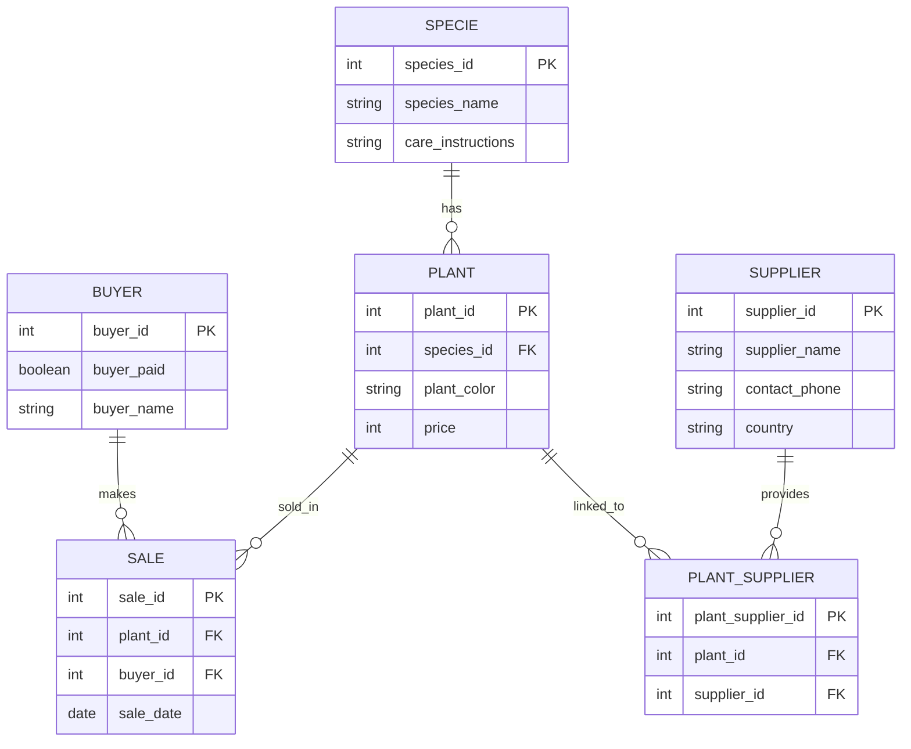

**Лабораторные работы по БД**

Перечень [лабораторные работы](https://edu.irnok.net/lib/exe/fetch.php?media=db:%D0%B2%D0%B0%D1%80%D0%B8%D0%B0%D0%BD%D1%82%D1%8B_%D0%B7%D0%B0%D0%B4%D0%B0%D0%BD%D0%B8%D0%B9_%D0%BF%D0%BE_%D1%83%D0%B4.pdf)

Telegram: [@Popaslonia]

# Постановка задачи (Ваш вариант)

**Магазин растений**

*Сущности:* 
- buyer: buyer_id (PK), buyer_paid, buyer_name
- plant: plant_id (PK), species_id, plant_color, price 
- sale: sale_id (PK), plant_id, sale_date, buyer_id
- specie: species_id (PK), species_name, care_instructions
- plant_supplier: plant_supplier_id (PK), plant_id, supplier_id
- supplier: supplier_id (PK), supplier_name, contact_phone, country

*Процессы:* 
- Клиент видит растения → выбирает → создаётся продажа в sale
- Цена фиксируется навсегда
- Если позже удаляется вид растения → продажа автоматически удаляется (каскад)
- Все действия логируются в аудит

# Лабораторная работа 1 (Проектирование логической и физической модели БД)

## ER-диаграмма

Первая нормальная форма (1NF): Соблюдена. Все атрибуты являются атомарными (неделимыми), повторяющиеся группы отсутствуют, каждая таблица имеет первичный ключ.

Вторая нормальная форма (2NF): Соблюдена. Во всех таблицах первичные ключи являются простыми (не составными), поэтому все неключевые атрибуты полностью зависят от первичного ключа.

Третья нормальная форма (3NF): Соблюдена. Транзитивные зависимости отсутствуют. Все неключевые атрибуты зависят только от первичного ключа, а не друг от друга.

Создание таблиц
```sql
-- 1. Таблица видов растений (specie)
CREATE TABLE firsovyury2271.specie (
    species_id        SERIAL PRIMARY KEY,
    species_name      TEXT NOT NULL,
    care_instructions TEXT
);

-- 2. Таблица конкретных растений (plant)
CREATE TABLE firsovyury2271.plant (
    plants_id    SERIAL PRIMARY KEY,
    species_id   INTEGER NOT NULL,
    plant_color  TEXT,
    price        INTEGER CHECK (price >= 0)
);

-- 3. Таблица поставщиков (supplier)
CREATE TABLE firsovyury2271.supplier (
    supplier_id     SERIAL PRIMARY KEY,
    supplier_name   TEXT NOT NULL,
    contact_phone   TEXT,
    country         TEXT
);

-- 4. Таблица связи растений и поставщиков (многие-ко-многим)
CREATE TABLE firsovyury2271.plant_supplier (
    plant_supplier_id SERIAL PRIMARY KEY,
    plant_id          INTEGER NOT NULL,
    supplier_id       INTEGER NOT NULL
);

-- 5. Таблица покупателей (buyer)
CREATE TABLE firsovyury2271.buyer (
    buyer_id    SERIAL PRIMARY KEY,
    buyer_paid  INTEGER DEFAULT 0,
    buyer_name  TEXT
);

-- 6. Таблица продаж (sale)
CREATE TABLE firsovyury2271.sale (
    sale_id     SERIAL PRIMARY KEY,
    plant_id    INTEGER NOT NULL,
    sale_date   DATE DEFAULT CURRENT_DATE,
    buyer_id    INTEGER NOT NULL
);

-- Добавляем внешние ключи 
ALTER TABLE firsovyury2271.plant
ADD CONSTRAINT fk_plant_specie
    FOREIGN KEY (species_id) REFERENCES firsovyury2271.specie(species_id)
    ON DELETE CASCADE;

ALTER TABLE firsovyury2271.sale
ADD CONSTRAINT fk_sale_plant
    FOREIGN KEY (plant_id) REFERENCES firsovyury2271.plant(plants_id)
    ON DELETE CASCADE;

ALTER TABLE firsovyury2271.sale
ADD CONSTRAINT fk_sale_buyer
    FOREIGN KEY (buyer_id) REFERENCES firsovyury2271.buyer(buyer_id)
    ON DELETE CASCADE;

ALTER TABLE firsovyury2271.plant_supplier
ADD CONSTRAINT fk_ps_plant
    FOREIGN KEY (plant_id) REFERENCES firsovyury2271.plant(plants_id)
    ON DELETE CASCADE;

ALTER TABLE firsovyury2271.plant_supplier
ADD CONSTRAINT fk_ps_supplier
    FOREIGN KEY (supplier_id) REFERENCES firsovyury2271.supplier(supplier_id)
    ON DELETE CASCADE;
```
Заполнение таблиц
